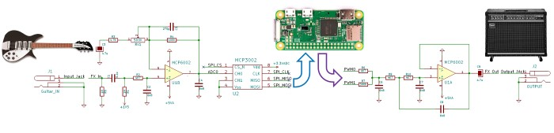
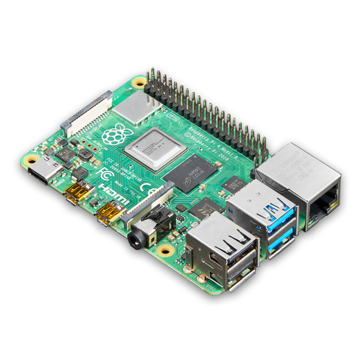
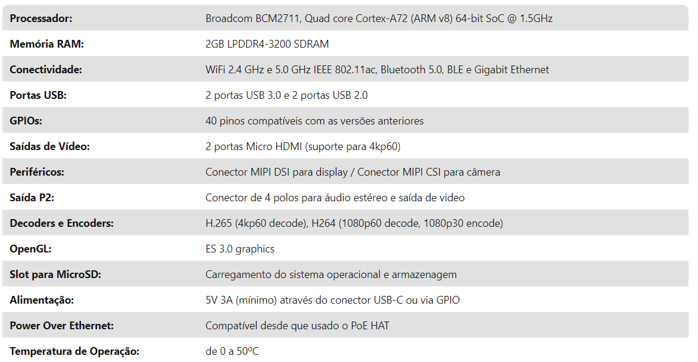
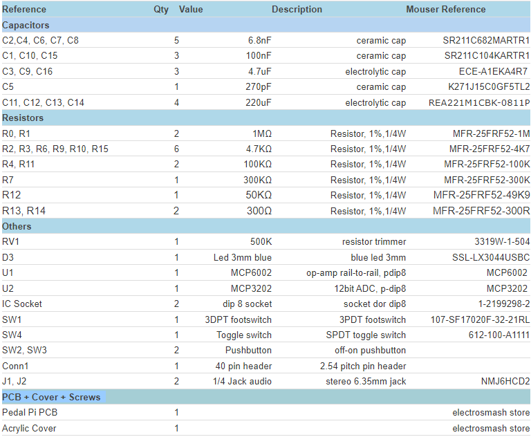
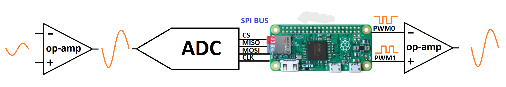
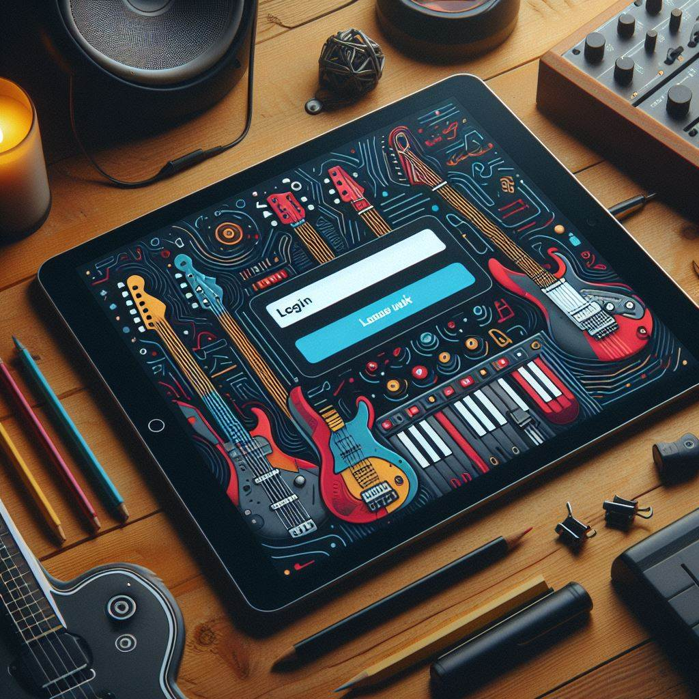
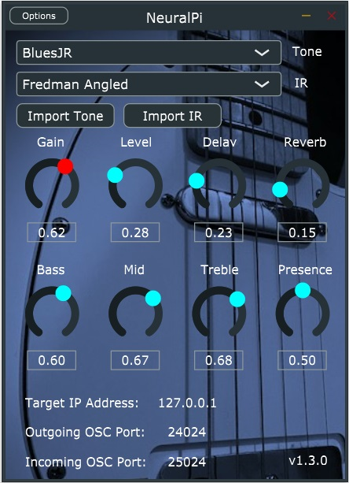

# IoT.SE.Opt.T - Pedalboard Virtual para Guitarras (Virtual guitar pedal board)

## Motivação

A Pedaleira Virtual para Guitarras surge da necessidade de proporcionar aos guitarristas uma solução prática e versátil para experimentar e criar efeitos sonoros sem a necessidade de equipamentos físicos. Com a Pedaleira Virtual, os músicos podem explorar uma ampla gama de efeitos de guitarra diretamente de seus computadores, facilitando o processo de composição, prática e gravação de músicas.

## Objetivos

- Oferecer uma experiência de pedaleira de guitarra completa e intuitiva através de uma aplicação virtual.
- Permitir aos usuários experimentar uma variedade de efeitos sonoros, incluindo distorção, delay, reverb, chorus, entre outros.
- Facilitar a criação e personalização de presets de efeitos para diferentes estilos musicais e preferências individuais.
- Integrar funcionalidades avançadas, como simulações de amplificadores e modelagem de gabinetes, para uma experiência sonora mais autêntica.
- Fornecer uma plataforma flexível e de código aberto para futuras expansões e colaborações da comunidade de músicos e desenvolvedores.

## Arquitetura

### Construção do projeto

A arquitetura principal do projeto utiliza o seguinte esquema:

Onde tem-se:

- Baseado no Raspberry Pi 4.
- Estágios analógicos utilizando amplificador operacional de trilho-a-trilho MCP6002.
- ADC: 12 bits / Taxa de amostragem 50Ksps (MCP3202).
- Estágio de saída: 12 bits (2x6bits PWMs rodando em paralelo)
- Pi 4:

    
- Conectores:
    - Jack de entrada, 1/4 polegadas desbalanceado, Zin=0.5MΩ.
    - Jack de saída, 1/4 polegadas desbalanceado, Zout=100Ω.
    - Fonte de alimentação: energia retirada da placa Pi Zero (micro-USB).

### Funcionamento

- O Estágio de Entrada: Amplifica e filtra o sinal da guitarra, preparando-o para o ADC (Conversor Analógico-Digital). O ADC envia o sinal para o PI 4 usando comunicação SPI.
  
- Pi 4: Ele recebe a forma de onda de áudio digitalizada do ADC e realiza todo o Processamento Digital de Sinal (DSP), criando efeitos (distorção, fuzz, delay, eco, tremolo...) que, por sua vez, devem ser pré-selecionados no painel de controle no aplicativo móvel do usuário. A partir da seleção do usuário, o aplicativo estabelece comunicação com a placa através de comunicação MQTT, via NodeRed.
  
- O Estágio de Saída: Uma vez que a nova forma de onda digital é criada, o Pi Zero cria um sinal analógico com dois PWMs combinados, o sinal é filtrado e preparado para ser enviado para o próximo pedal ou o amplificador de guitarra.

Portanto, o funcionamento pode ser representado pela seguinte imagen:

### Aplicativo e Painel de Controle

Para a criação do aplicativo, pretende-se utilizar o software Godot, amplamente utilizado para o desenvolvimento de jogos, possibilitando assim um aplicativo intuitivo e funcional. Pretende-se criar um sistema de login para o usuário, para que seja possível salvar os estilos musicais e perfis de pedaleira, possibilitando uma maior personalização por parte do usuário.

Segue uma imagem conceitual da tela de login:

E a seguinte imagem serve como inspiração para a criação do painel de controle:

## Manual de Instalação e Configuração

### Instalação e Uso do Node-RED

#### Utilizando Instalação Local

- Certifique-se de ter o Node.js instalado em seu sistema. Se não tiver, você pode baixar e instalar a partir do site oficial: nodejs.org.
- Abra um terminal ou prompt de comando e execute o seguinte comando para instalar o Node-RED globalmente:
- "npm install -g --unsafe-perm node-red"

#### Utilizando Docker

- Se preferir, você também pode usar o Docker para executar o Node-RED:
- Certifique-se de ter o Docker instalado em seu sistema.
- Execute o seguinte comando para baixar e executar a imagem do Node-RED:
- "docker run -it -p 1880:1880 --name mynodered nodered/node-red"

#### Iniciando o Servidor Node-RED:

- Após instalar o Node-RED, você pode iniciar o servidor executando o seguinte comando no terminal:
- "node-red"
- Se estiver usando Docker, o servidor Node-RED já estará em execução após o comando docker run.

#### Acessando a Interface Web do Node-RED:
- Abra um navegador da web e vá para o seguinte endereço:
- "http://localhost:1880"
- Se estiver executando o Node-RED em uma máquina remota, substitua localhost pelo endereço IP da máquina.

#### Criando e Editando Fluxos:

- Na interface do Node-RED, você verá um ambiente de desenvolvimento visual onde pode criar e editar fluxos.

- Adicionando Nós: Arraste e solte nós da barra lateral para a área de trabalho. Existem nós para interagir com dispositivos físicos, serviços da web, bancos de dados e muito mais.
- Conectando Nós: Conecte nós arrastando uma linha entre portas de entrada e saída. Isso define o fluxo de dados entre os nós.
- Configurando Nós: Dê um duplo clique em um nó para abrir suas configurações. Aqui você pode inserir informações como endereços IP, chaves de API e outras opções relevantes.
- Depurando e Testando: Use o recurso de depuração integrado para monitorar o fluxo de dados e verificar se tudo está funcionando conforme o esperado.

#### Implantação do Fluxo:

- Quando estiver satisfeito com seu fluxo, clique no botão "Deploy" no canto superior direito da interface. Isso salvará suas alterações e implantará o fluxo para execução.

### Instalação e utilização do Godot Engine

#### Instalação do Godot

- Acesse o site oficial do Godot em https://godotengine.org/.
- Clique no botão "Download" na página inicial.
- Escolha a versão do Godot que deseja baixar. É recomendável baixar a versão estável mais recente.
- Selecione o sistema operacional correto para o qual deseja baixar o Godot (Windows, macOS, Linux).
- Baixe o instalador apropriado para o seu sistema operacional.
- Após o download, execute o instalador e siga as instruções para concluir a instalação do Godot.

#### Configuração do Godot:

- Após a instalação, abra o Godot Engine.
- Você será apresentado ao Gerenciador de Projetos. Aqui você pode criar um novo projeto ou abrir um existente.
- Para criar um novo projeto, clique em "Novo Projeto" e selecione o local onde deseja salvar o projeto.
- Escolha um modelo inicial para o seu projeto. Por exemplo, você pode escolher entre 2D, 3D ou um projeto vazio.
- Depois de criar o projeto, você será levado ao editor principal do Godot.

#### Utilização do Godot:

- No editor do Godot, você pode começar a criar e desenvolver seu jogo ou aplicativo.
- Use a hierarquia de cenas para organizar os elementos do seu jogo.
- Adicione novos nós às suas cenas usando o painel de nós. Existem nós para sprites, colisores, áudio, scripts, e muito mais.
- Crie scripts para adicionar comportamentos e lógica ao seu jogo. O Godot usa sua própria linguagem de script chamada GDScript, mas também suporta outras linguagens como C#.
- Teste seu jogo ou aplicativo clicando no botão "Play" para visualizá-lo em ação no editor.
- Quando estiver satisfeito com o seu projeto, você pode exportá-lo para várias plataformas, como Windows, macOS, Linux, Android, iOS, HTML5, entre outras.

## Referências

- Documentação: relacionada à inspiração para o projeto:
  - [ElectroSmash](https://www.electrosmash.com/pedal-pi)
  - [NeuralPi](https://github.com/GuitarML/NeuralPi)
  - [Pi-FX : A Raspberry Pi-Based Pedal Board](https://tibbbz.medium.com/guitarix-the-pi-dle-board-8d6298ca8e42)
  - Documentação oficial da Web Audio API: [https://developer.mozilla.org/en-US/docs/Web/API/Web_Audio_API](https://developer.mozilla.org/en-US/docs/Web/API/Web_Audio_API)
  - Documentação oficial da Web MIDI API: [https://www.w3.org/TR/webmidi/](https://www.w3.org/TR/webmidi/)
