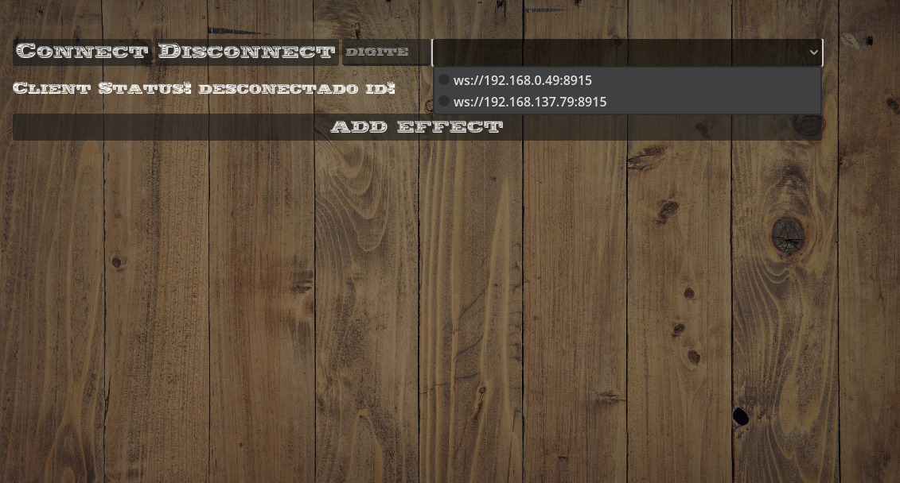
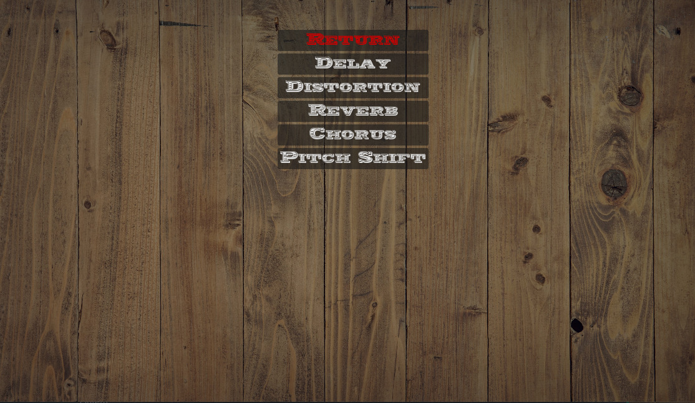

# IoT.SE.Opt.T - IoT Pedalboard Virtual para Guitarras (IoT Virtual guitar pedal board)

## Project Overview:

The Virtual Guitar Pedalboard was developed to meet the need to provide guitarists with a practical and versatile solution to experiment with and create sound effects, eliminating the dependence on bulky and expensive physical equipment. With this virtual pedalboard, musicians have the freedom to explore a wide range of guitar effects directly on their computers. This simplifies and enriches the process of composing, practicing, and recording music, allowing guitarists to adjust and customize their sounds intuitively and efficiently. Additionally, the virtual pedalboard provides an ideal environment for testing new ideas and effect configurations, helping to inspire musical creativity.

## Motivation for the Project

The Virtual Guitar Pedalboard was born out of the need to provide guitarists with an innovative and affordable solution to explore and create high-quality sound effects without relying on expensive and bulky physical equipment. Guitarists, whether beginners or professionals, often face challenges when trying to find and combine various pedals and equipment to achieve desired sounds. This not only demands a significant financial investment but can also be logistically complicated, especially during travel or live performances.

With the Virtual Guitar Pedalboard, we aim to solve these problems by offering a digital platform that allows musicians to access a wide range of guitar effects directly from their computers. Our solution simplifies the process of composing, practicing, and recording, allowing guitarists to adjust and customize their sounds with ease and precision. Additionally, the virtual pedalboard is ideal for experimentation, encouraging musical creativity and innovation. Guitarists can test new effect combinations and settings without physical limitations, helping them discover new sounds and styles.

In summary, the motivation to create the Virtual Guitar Pedalboard is to provide musicians with a powerful, flexible, and affordable tool that enhances their skills and expands their creative possibilities, all while eliminating the barriers imposed by traditional equipment.

## Objectives of the Project

- Provide a Complete and Intuitive Experience:
  - Develop a virtual application that offers a complete and intuitive guitar pedalboard experience, allowing users to navigate and easily use the various features and effects available.

- Variety of Sound Effects:
  - Allow users to experience a wide range of sound effects, including distortion, delay, reverb, chorus, among others, enabling the creation of unique and customized sounds for each musical style.

- Creation and Customization of Presets:
  - Facilitate the creation and customization of effect presets, allowing guitarists to adjust parameters according to different musical styles and individual preferences, storing settings for easy access and reuse.

- Advanced Features:
  - Integrate advanced features, such as amplifier simulations and cabinet modeling, providing a more authentic and realistic sound experience that approaches traditional physical equipment.

- Flexible and Open-Source Platform:
  - Provide a flexible and open-source platform that allows for future expansions and collaborations from the community of musicians and developers, encouraging continuous innovation and software improvement through community contributions.

## Architecture and Communication Protocols

- The Virtual Guitar Pedalboard

  - The Virtual Guitar Pedalboard uses an architecture based on WebSocket communication, allowing efficient and real-time interaction between the user and the system. Below, we describe the main components and the project workflow:

- Connecting the Guitar to the Computer:
  - The user connects the guitar to an audio interface device known as Guitar Link, which is connected to the computer. The Guitar Link converts the guitar's analog signal into a digital format that can be processed by the application.

| **Features**               | **Description**                                                                                                                                   |
|----------------------------|---------------------------------------------------------------------------------------------------------------------------------------------------|
| Additional Output          | P10 for stereo headphones or monitoring with active speakers (boxes).                                                                             |
| Compatibility              | Works directly with PC or MAC, includes installation CD.                                                                                          |
| Durability                 | High-quality components that ensure durability.                                                                                                   |
| USB Power                  | USB port does not require external power.                                                                                                         |
| Installation               | Easy installation (PLUG and PLAY).                                                                                                                |
| USB Interface              | Guitar Link is a USB interface device that allows you to easily connect your guitar to the PC for professional amplification, recording, and editing work. |
| Effects                    | Use of classic studio effects as well as on stage.                                                                                                |
| Recording and Editing      | High-quality digital recording and editing.                                                                                                       |
| File Playback              | Playback of MP3, WAV, AIFF files.                                                                                                                 |
| Operating System Compatibility | Compatible with Mac OS and Windows XP/Vista/7/8.                                                                                           |
| Real-time Playback         | Real-time playback without latency/delay in playback.                                                                                             |
| Audio Quality              | Stereo sound for headphones, 16-bit audio quality, 44.1/48kHz.                                                                                    |

- Audio Library and Processing Engine:
  - On the computer, a dedicated audio library receives the guitar's digital signal. This library is responsible for capturing and preparing the audio for processing. Then, the audio effects engine kicks in, ready to apply the effects selected by the user.

- Mobile Client Application:
  - The user interacts with the Virtual Pedalboard through a mobile client application. This application provides an intuitive interface for selecting, configuring, and adjusting the desired effects.

- WebSocket Communication:
  - The mobile client application communicates with the server on the Raspberry Pi 4 Model B using WebSockets. This technology enables real-time bidirectional communication, essential to ensure that the effect changes made by the user are applied instantly.

### Raspberry Pi Specifications

| **Features**                                   | **Description**                                                                                               |
|----------------------------------------------|--------------------------------------------------------------------------------------------------------------|
| **Processor**                                | Broadcom BCM2711, Quad core Cortex-A72 (ARM v8) 64-bit SoC @ 1.8GHz                                           |
| **Memory**                                   | 1GB, 2GB, 4GB, or 8GB LPDDR4-3200 SDRAM (depending on model)                                                  |
| **Wireless Connectivity**                    | 2.4 GHz and 5.0 GHz IEEE 802.11ac wireless, Bluetooth 5.0, BLE                                                |
| **Ethernet**                                 | Gigabit Ethernet                                                                                              |
| **USB Ports**                                | 2 USB 3.0 ports; 2 USB 2.0 ports                                                                              |
| **GPIO Header**                              | Standard 40-pin Raspberry Pi GPIO header (fully backward compatible with previous models)                     |
| **Display**                                  | 2 micro-HDMI® ports (supports up to 4kp60)                                                                    |
| **MIPI DSI Display Port**                    | 2-lane MIPI DSI display port                                                                                  |
| **MIPI CSI Camera Port**                     | 2-lane MIPI CSI camera port                                                                                   |
| **Audio/Video Port**                         | 4-pole stereo audio and composite video port                                                                  |
| **Video Decoding/Encoding**                  | H.265 (4kp60 decode), H264 (1080p60 decode, 1080p30 encode)                                                   |
| **Graphics**                                 | OpenGL ES 3.1, Vulkan 1.0                                                                                     |
| **Storage**                                  | Micro-SD card slot for operating system loading and data storage                                              |
| **Power Supply**                             | 5V DC via USB-C connector (minimum 3A*), 5V DC via GPIO header (minimum 3A*), Power over Ethernet (PoE) enabled (requires separate PoE HAT) |
| **Operating Temperature**                    | 0 – 50 degrees C ambient                                                                                      |

- **Effect Application:**
  - When the user selects and configures effects on the mobile application, these settings are sent to the server via WebSocket. The server then applies the received effects to the guitar audio in real-time using the audio processing engine.

- **Processed Audio Return:**
  - After the effects are applied, the processed audio is returned to the client. The user then hears the guitar sound with the applied effects directly on their device, allowing for immediate feedback and a continuous, perceptible latency-free experience.

### Architecture Benefits

- **Real-Time Interactivity:** WebSocket communication ensures that changes made in the client application are immediately reflected in the processed audio.
- **Flexibility and Customization:** Users can customize a wide range of effects directly from their mobile devices, adjusting parameters in real-time according to their needs and preferences.
- **Simple Integration:** Using a Guitar Link simplifies the connection of the guitar to the system, making the setup accessible for both beginners and professionals.
- **Authentic Experience:** The audio processing engine on the computer applies effects with high fidelity, providing an authentic sound experience that closely resembles the use of traditional physical equipment.

This modern and efficient architecture not only meets the practical needs of guitarists but also paves the way for future expansions and improvements, maintaining flexibility and open collaboration as fundamental pillars of the project.

## Dashboard

- **Connection Buttons:**
  - At the top of the screen, you will see two buttons: “CONNECT” and “DISCONNECT.” You can use these buttons to connect or disconnect from a server or service.
- **Client Status:**
  - Just below the connection buttons, there is a message showing the current connection status. If you are connected, it will say “CLIENT STATUS: CONNECTED.” If you are disconnected, it will say “CLIENT STATUS: DISCONNECTED.”
- **WebSocket Addresses:**
  - Below the client status, there are two WebSocket addresses. These are the addresses the application will use to connect to the server or service.
- **Add Effect:**
  - At the bottom of the screen, there is an “ADD EFFECT” button. This button allows you to add special effects to your connection.

After selecting the “ADD EFFECT” option, you will likely see a screen with different types of audio effects to apply to your virtual guitar pedalboard. Here are some possible options that may appear:

- **DELAY:**
  - This is an effect that reproduces a recorded sound and plays it back after a period of time, creating an echo effect.
- **DISTORTION:**
  - This effect alters the sound in a way that makes it harsher or rougher. It is commonly used in rock music to create a heavier guitar sound.
- **REVERB:**
  - This effect simulates the sound of a specific environment, such as a large room or a cave. It gives the sound a sense of space and depth.
- **CHORUS:**
  - This effect makes the sound appear as if multiple people are playing or singing at the same time, creating a fuller and richer sound.
- **PITCH SHIFT:**
  - This effect changes the pitch of the sound, making it appear higher or lower than it actually is.

The image shows an audio effect control screen of your application.

- **Reverb:**
  - This is the selected effect. There is a slider to adjust the intensity of the reverb effect. The current value is 0.
- **Room Size:**
  - This slider allows the user to adjust the “room” size for the reverb effect. The current value is 0.8.
- **Damping:**
  - This slider adjusts the damping of the reverb effect. The current value is 0.5.
- **Spread:**
  - This slider adjusts the spread of the reverb effect. The current value is 1.
- **High Pass:**
  - This slider adjusts the high-pass filter cutoff frequency. The current value is 0.
- **Dry and Wet:**
  - These are sliders that adjust the balance between the original audio signal (Dry) and the processed audio signal (Wet). The current values are 0 and 0.5, respectively.

In the upper left corner, there is a switch to connect or disconnect the client. Currently, the client status is disconnected.

In the upper center, there is a switch to enable or disable the effect. Next to it, there is a button to remove the effect.

At the bottom, there is a button to add more effects.

## Future Plans

1. **Client-Side Recording System:**
   
   - Implement a recording system directly in the client application, allowing users to capture and store their practice sessions or performances. This facilitates the process of reviewing and analyzing musical performance.

2. **User Preset Saving:**
   
   - Add functionality to save and load user-created effect presets. This will enable guitarists to quickly access their favorite settings, improving efficiency during practice and performances.

3. **Cloud Service Integration:**

   - Implement integration with cloud storage services so users can save their recordings and presets in the cloud, ensuring access from any device and location.

4. **Enhanced User Interface:**

   - Improve the client application interface to make it even more intuitive and user-friendly, with interactive graphics and more precise controls for effect adjustments.

5. **Additional Effects and Customization:**

   - Expand the library of available effects, including amp simulations, boutique pedals, and custom effects. Additionally, allow users to adjust advanced effect parameters for even greater customization.

## Time to Make the project by yourself

For information on how to install and configure the apps used in this project, [click here](https://github.com/DimitriMargutti/IoT.SE.Opt.T---Virtual-guitar-pedal-board/blob/main/Instalation_and_configuration/README.md)

## Mentorship

This project was developed with the mentorship of [Dhiego Fernandes](https://github.com/DhiegoFC/IoT_for_Embedded_Devices), a professor at the State University of São Paulo.

## References

- Documentation: related to the project's inspiration:
  - [GDExtension](https://docs.godotengine.org/en/stable/tutorials/scripting/gdextension/index.html)
  - [Godot Engine](https://godotengine.org)
  - [PortAudio](https://github.com/PortAudio/portaudio)

  
