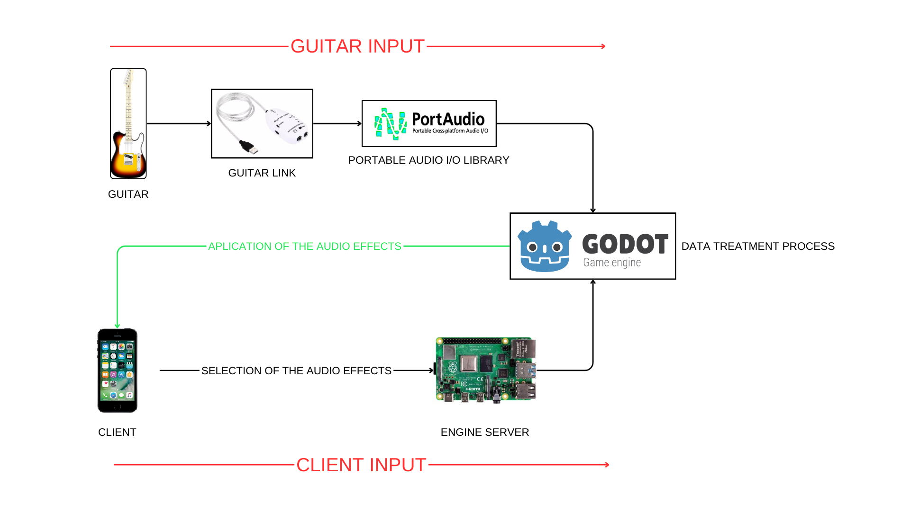
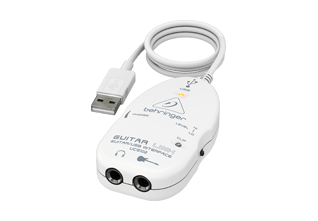
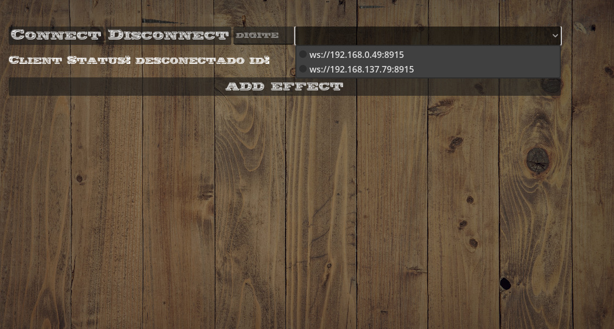
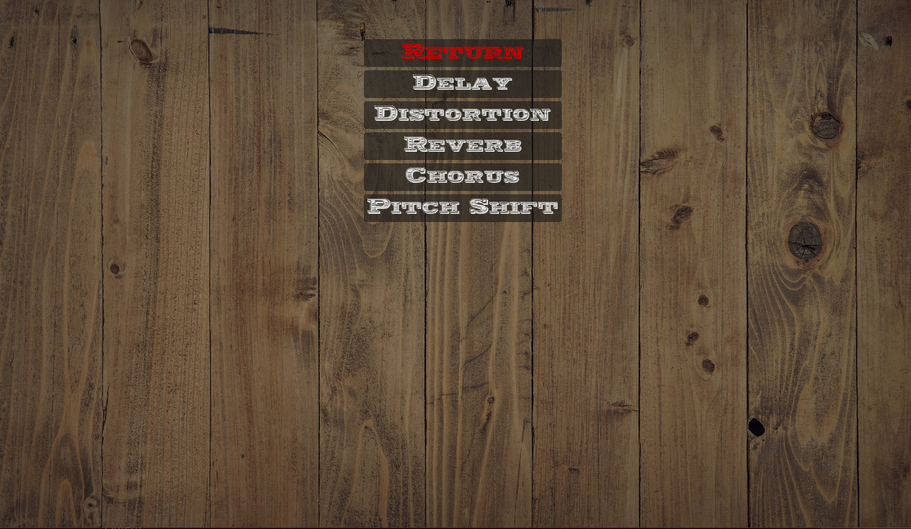
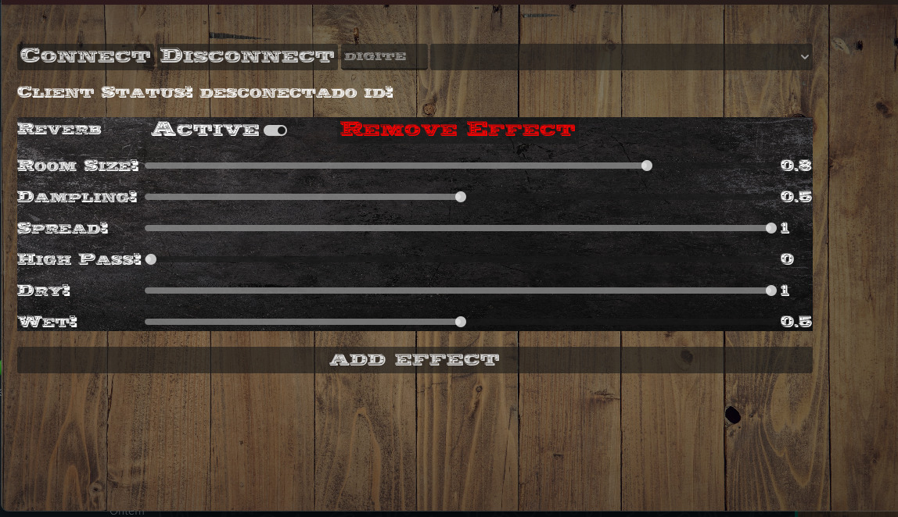

# IoT.SE.Opt.T - "Pedalboard" Virtual IoT para Guitarras (Virtual guitar pedal board)

## Visão Geral:

A Pedaleira Virtual para Guitarras foi desenvolvida para atender à necessidade de oferecer aos guitarristas uma solução prática e versátil para experimentar e criar efeitos sonoros, eliminando a dependência de equipamentos físicos volumosos e caros. Com esta pedaleira virtual, os músicos têm a liberdade de explorar uma vasta gama de efeitos de guitarra diretamente em seus computadores. Isso simplifica e enriquece o processo de composição, prática e gravação de músicas, permitindo que os guitarristas ajustem e personalizem seus sons de maneira intuitiva e eficiente. Além disso, a pedaleira virtual proporciona um ambiente ideal para testar novas ideias e configurações de efeitos, ajudando a inspirar a criatividade musical.

## Motivação para o projeto

A Pedaleira Virtual para Guitarras nasceu da necessidade de proporcionar aos guitarristas uma solução inovadora e acessível para explorar e criar efeitos sonoros de alta qualidade sem depender de equipamentos físicos caros e volumosos. Os guitarristas, sejam iniciantes ou profissionais, frequentemente enfrentam desafios ao tentar encontrar e combinar diversos pedais e equipamentos para obter os sons desejados. Isso não só demanda um investimento financeiro significativo, mas também pode ser logisticamente complicado, especialmente durante viagens ou apresentações ao vivo.

Com a Pedaleira Virtual, buscamos resolver esses problemas oferecendo uma plataforma digital que permite aos músicos acessar uma ampla gama de efeitos de guitarra diretamente de seus computadores. Nossa solução facilita o processo de composição, prática e gravação, permitindo que os guitarristas ajustem e personalizem seus sons com facilidade e precisão. Além disso, a pedaleira virtual é ideal para experimentação, incentivando a criatividade e a inovação musical. Os guitarristas podem testar novas combinações de efeitos e configurações sem limitações físicas, ajudando-os a descobrir novos sons e estilos.

Em suma, a motivação para criar a Pedaleira Virtual para Guitarras é fornecer aos músicos uma ferramenta poderosa, flexível e acessível que eleve suas habilidades e expanda suas possibilidades criativas, tudo isso enquanto elimina as barreiras impostas pelos equipamentos tradicionais.

## Objetivos do projeto

- Proporcionar uma Experiência Completa e Intuitiva:
  - Desenvolver uma aplicação virtual que oferece uma experiência de pedaleira de guitarra completa e intuitiva, permitindo que os usuários naveguem e utilizem facilmente os diversos recursos e efeitos disponíveis.

- Variedade de Efeitos Sonoros:
  - Permitir aos usuários experimentar uma ampla gama de efeitos sonoros, incluindo distorção, delay, reverb, chorus, entre outros, possibilitando a criação de sons únicos e personalizados para cada estilo musical.

- Criação e Personalização de Presets:
  - Facilitar a criação e personalização de presets de efeitos, permitindo que os guitarristas ajustem os parâmetros de acordo com diferentes estilos musicais e preferências individuais, armazenando configurações para fácil acesso e reutilização.

- Funcionalidades Avançadas:
  - Integrar funcionalidades avançadas, como simulações de amplificadores e modelagem de gabinetes, proporcionando uma experiência sonora mais autêntica e realista, que se aproxima dos equipamentos físicos tradicionais.

- Plataforma Flexível e de Código Aberto:
  - Fornecer uma plataforma flexível e de código aberto que permite futuras expansões e colaborações da comunidade de músicos e desenvolvedores, incentivando a inovação contínua e a melhoria do software através de contribuições comunitárias.

## Arquitetura e protocolos de comando

A Pedaleira Virtual para Guitarras utiliza uma arquitetura baseada em comunicação via WebSocket, permitindo uma interação eficiente e em tempo real entre o usuário e o sistema. A seguir, descrevemos os principais componentes e o fluxo de funcionamento do projeto:

- Conexão da Guitarra ao Computador:
  - O usuário conecta a guitarra a um dispositivo de interface de áudio, conhecido como Guitar Link, que está conectado ao computador. O Guitar Link converte o sinal analógico da guitarra em um formato digital que pode ser processado pela aplicação.
 

| **Características**                                                                                             | **Descrição**                                                                                                                                                          |
|---------------------------------------------------------------------------------------------------------------|----------------------------------------------------------------------------------------------------------------------------------------------------------------------|
| Saída Adicional                                                                                               | P10 para fone de ouvido estéreo ou para monitoramento com alto-falantes ativos (caixas).                                                                             |
| Compatibilidade                                                                                               | Trabalha diretamente com PC ou MAC, acompanha CD de instalação.                                                                                                      |
| Durabilidade                                                                                                  | Componentes de alta qualidade que garantem a durabilidade.                                                                                                           |
| Alimentação USB                                                                                               | Porta USB não necessita de alimentação externa.                                                                                                                      |
| Instalação                                                                                                    | Fácil instalação (PLUG and PLAY).                                                                                                                                    |
| Interface USB                                                                                                | Guitar Link é um dispositivo com interface USB que permite conectar facilmente sua guitarra ao PC para um trabalho profissional de amplificação, gravação e edição.  |
| Efeitos                                                                                                       | Uso dos efeitos clássicos em estúdio bem como no palco.                                                                                                              |
| Gravação e Edição                                                                                            | Gravação digital e edição de alta qualidade.                                                                                                                          |
| Reprodução de Arquivos                                                                                       | Reprodução de arquivos MP3, WAV, AIFF.                                                                                                                               |
| Compatibilidade com Sistemas Operacionais                                                                    | Compatível com Mac OS e Windows XP/Vista/7/8.                                                                                                                        |
| Reprodução em Tempo Real                                                                                      | Reprodução em tempo real sem latência/atraso na reprodução.                                                                                                           |
| Qualidade de Áudio                                                                                           | Som estéreo para fones de ouvido, qualidade de áudio 16-bit, 44.1/48kHz.                                                                                              |

- Biblioteca de Áudio e Engine de Processamento:
  - No computador, uma biblioteca de áudio dedicada recebe o sinal digital da guitarra. Esta biblioteca é responsável por capturar e preparar o áudio para processamento. Em seguida, a engine de efeitos de áudio entra em ação, pronta para aplicar os efeitos selecionados pelo usuário.

- Aplicação Cliente no Celular:
  - O usuário interage com a Pedaleira Virtual através de uma aplicação cliente no celular. Esta aplicação oferece uma interface intuitiva para selecionar, configurar e ajustar os efeitos desejados.

- Comunicação via WebSocket:
  - A aplicação cliente no celular se comunica com o servidor na Raspberry 4 model B usando WebSockets. Esta tecnologia permite uma comunicação bidirecional em tempo real, essencial para garantir que as alterações de efeitos feitas pelo usuário sejam aplicadas instantaneamente.
 

### Especificações do Raspberry Pi

| **Características**                                   |**Descrição**                                                                                               |
|----------------------------------------------|----------------------------------------------------------------------------------------------------|
| **Processador**                              | Broadcom BCM2711, Quad core Cortex-A72 (ARM v8) SoC de 64 bits @ 1,8GHz                            |
| **Memória**                                  | 1GB, 2GB, 4GB ou 8GB LPDDR4-3200 SDRAM (dependendo do modelo)                                      |
| **Conectividade Sem Fio**                    | 2,4 GHz e 5,0 GHz IEEE 802.11ac wireless, Bluetooth 5.0, BLE                                       |
| **Ethernet**                                 | Gigabit Ethernet                                                                                   |
| **Portas USB**                               | 2 portas USB 3.0; 2 portas USB 2.0                                                                 |
| **Header GPIO**                              | Conector GPIO padrão de 40 pinos do Raspberry Pi (totalmente compatível com versões anteriores)    |
| **Display**                                  | 2 portas micro-HDMI® (suporta até 4kp60)                                                           |
| **Porta de Display MIPI DSI**                | Porta de display MIPI DSI de 2 pistas                                                              |
| **Porta de Câmera MIPI CSI**                 | Porta de câmera MIPI CSI de 2 pistas                                                               |
| **Porta de Áudio/Vídeo**                     | Porta de áudio estéreo de 4 polos e vídeo composto                                                 |
| **Decodificação/Codificação de Vídeo**       | H.265 (decodificação 4kp60), H264 (decodificação 1080p60, codificação 1080p30)                      |
| **Gráficos**                                 | OpenGL ES 3.1, Vulkan 1.0                                                                          |
| **Armazenamento**                            | Slot para cartão Micro-SD para carregar sistema operacional e armazenamento de dados               |
| **Fonte de Alimentação**                     | 5V DC via conector USB-C (mínimo 3A*), 5V DC via header GPIO (mínimo 3A*), Power over Ethernet (PoE) habilitado (requer PoE HAT separado) |
| **Temperatura de Operação**                  | 0 – 50 graus C ambiente                                                                            |

- Aplicação dos Efeitos:
  - Quando o usuário seleciona e configura os efeitos na aplicação do celular, essas configurações são enviadas ao servidor através do WebSocket. O servidor, por sua vez, aplica os efeitos recebidos ao áudio da guitarra em tempo real, utilizando a engine de processamento de áudio.

- Retorno do Áudio Processado:
  - Após a aplicação dos efeitos, o áudio processado é devolvido ao cliente. O usuário então ouve o som da guitarra com os efeitos aplicados diretamente em seu dispositivo, permitindo um feedback imediato e uma experiência de uso contínua e sem latência perceptível.

### Benefícios da Arquitetura
- Interatividade em Tempo Real: A comunicação via WebSocket garante que as mudanças feitas na aplicação cliente sejam refletidas imediatamente no áudio processado.
- Flexibilidade e Personalização: Os usuários podem personalizar uma vasta gama de efeitos diretamente do celular, ajustando parâmetros em tempo real conforme suas necessidades e preferências.
- Integração Simples: O uso de um Guitar Link simplifica a conexão da guitarra ao sistema, tornando a configuração acessível tanto para iniciantes quanto para profissionais.
- Experiência Autêntica: A engine de processamento de áudio no computador aplica os efeitos com alta fidelidade, proporcionando uma experiência sonora autêntica que se aproxima da utilização de equipamentos físicos tradicionais.
  
Essa arquitetura moderna e eficiente não só atende às necessidades práticas dos guitarristas, como também abre caminho para futuras expansões e melhorias, mantendo a flexibilidade e a colaboração aberta como pilares fundamentais do projeto.
## Dashboard

- Botões de Conexão:
  - No topo da tela, você verá dois botões: “CONNECT” e “DISCONNECT”. Você pode usar esses botões para se conectar ou desconectar de um servidor ou serviço.
- Status do Cliente:
  - Logo abaixo dos botões de conexão, há uma mensagem que mostra o status atual da sua conexão. Se você estiver conectado, dirá “CLIENT STATUS: CONNECTED”. Se você estiver desconectado, dirá “CLIENT STATUS: DISCONNECTED”.
- Endereços de Web Socket:
  - Abaixo do status do cliente, há dois endereços de web socket. Esses são os endereços que o aplicativo usará para se conectar ao servidor ou serviço.
- Adicionar Efeito:
  - Na parte inferior da tela, há um botão “ADD EFFECT”. Este botão permite adicionar efeitos especiais à sua conexão.
    

 
Após selecionar a opção “ADD EFFECT”, você provavelmente verá uma tela com diferentes tipos de efeitos de áudio para aplicar à sua pedaleira virtual de guitarra. Aqui estão algumas possíveis opções que podem aparecer:

- DELAY:
  - Este é um efeito que reproduz um som que foi gravado e o toca novamente após um período de tempo. Isso cria um efeito de eco.
- DISTORTION:
  - Este é um efeito que altera o som de uma maneira que o torna mais áspero ou mais duro. É comumente usado em música de rock para criar um som de guitarra mais pesado.
- REVERB:
  - Este é um efeito que simula o som de um ambiente específico, como uma sala grande ou uma caverna. Isso dá ao som uma sensação de espaço e profundidade.
- CHORUS:
  - Este é um efeito que faz com que o som pareça como se várias pessoas estivessem tocando ou cantando ao mesmo tempo. Isso cria um som mais completo e rico.
- PITCH SHIFT:
  - Este é um efeito que altera a altura do som. Isso pode fazer com que o som pareça mais alto ou mais baixo do que realmente é.
    

 
A imagem mostra uma tela de controle de efeitos de áudio do seu aplicativo. 

- Reverb: E
  - Este é o efeito que foi selecionado. Há um controle deslizante para ajustar a intensidade do efeito de reverberação. O valor atual é 0.
- Room Size:
  - Este controle deslizante permite ao usuário ajustar o tamanho da “sala” para o efeito de reverberação. O valor atual é 0.8.
- Damping:
  - Este controle deslizante ajusta o amortecimento do efeito de reverberação. O valor atual é 0.5.
- Spread:
  - Este controle deslizante ajusta a dispersão do efeito de reverberação. O valor atual é 1.
- High Pass:
  - Este controle deslizante ajusta a frequência de corte do filtro passa-alta. O valor atual é 0.
- Dry e Wet:
  - Estes são controles deslizantes que ajustam o equilíbrio entre o sinal de áudio original (Dry) e o sinal de áudio processado (Wet). Os valores atuais são 0 e 0.5, respectivamente.
  
No canto superior esquerdo, há um interruptor para conectar ou desconectar o cliente. Atualmente, o status do cliente está desconectado.

No centro superior, há um interruptor para ativar ou desativar o efeito. Ao lado, há um botão para remover o efeito.

Na parte inferior, há um botão para adicionar mais efeitos.

## Hora de fazer você mesmo!

Para informações sobre como instalar e configurar os aplicativos utilizados neste projeto [clique aqui](https://github.com/DimitriMargutti/IoT.SE.Opt.T---Virtual-guitar-pedal-board/blob/main/Instalation_and_configuration/README.md)

## Mentoria

Este projeto foi desenvolvido com a mentoria de [Dhiego Fernandes](https://github.com/DhiegoFC/IoT_for_Embedded_Devices) Carvalho professor at State University of São Paulo

## Referências

- Documentação: relacionada à inspiração para o projeto:
  - [GDExtension](https://docs.godotengine.org/en/stable/tutorials/scripting/gdextension/index.html)
  - [Godot Engine](https://godotengine.org)
  - [PortAudio](https://github.com/PortAudio/portaudio)
  
