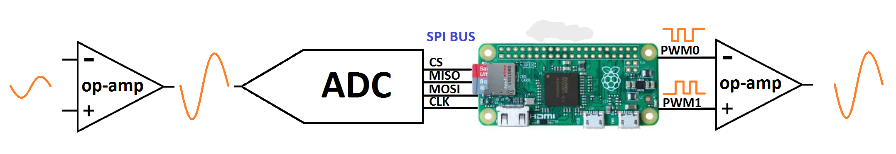
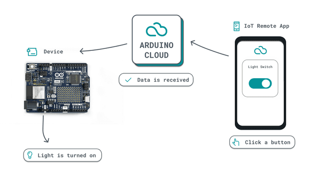

# IoT.SE.Opt.T - Pedalboard Virtual para Guitarras (Virtual guitar pedal board)

## Motivação

A Pedaleira Virtual para Guitarras surge da necessidade de proporcionar aos guitarristas uma solução prática e versátil para experimentar e criar efeitos sonoros sem a necessidade de equipamentos físicos. Com a Pedaleira Virtual, os músicos podem explorar uma ampla gama de efeitos de guitarra diretamente de seus computadores, facilitando o processo de composição, prática e gravação de músicas.

## Objetivos

- Oferecer uma experiência de pedaleira de guitarra completa e intuitiva através de uma aplicação virtual.
- Permitir aos usuários experimentar uma variedade de efeitos sonoros, incluindo distorção, delay, reverb, chorus, entre outros.
- Facilitar a criação e personalização de presets de efeitos para diferentes estilos musicais e preferências individuais.
- Integrar funcionalidades avançadas, como simulações de amplificadores e modelagem de gabinetes, para uma experiência sonora mais autêntica.
- Fornecer uma plataforma flexível e de código aberto para futuras expansões e colaborações da comunidade de músicos e desenvolvedores.

## Arquitetura

### Construção do projeto

A arquitetura principal do projeto utiliza o seguinte esquema:

Onde tem-se:

- Baseado no Raspberry Pi Zero (núcleo ARM11 de 1GHz).
- Estágios analógicos utilizando amplificador operacional de trilho-a-trilho MCP6002.
- ADC: 12 bits / Taxa de amostragem 50Ksps (MCP3202).
- Estágio de saída: 12 bits (2x6bits PWMs rodando em paralelo)
- Pi Zero:
    - Núcleo ARM11 de 1GHz.
    - 512MB de SDRAM LPDDR2.
    - Slot para cartão Micro-SD.
- Conectores:
    - Jack de entrada, 1/4 polegadas desbalanceado, Zin=0.5MΩ.
    - Jack de saída, 1/4 polegadas desbalanceado, Zout=100Ω.
    - Fonte de alimentação: energia retirada da placa Pi Zero (micro-USB).

### Funcionamento

- O Estágio de Entrada: Amplifica e filtra o sinal da guitarra, preparando-o para o ADC (Conversor Analógico-Digital). O ADC envia o sinal para o PI ZERO usando comunicação SPI.
  
- Pi ZERO: Ele recebe a forma de onda de áudio digitalizada do ADC e realiza todo o Processamento Digital de Sinal (DSP), criando efeitos (distorção, fuzz, delay, eco, tremolo...) que, por sua vez, devem ser pré-selecionados no painel de controle no aplicativo móvel do usuário. A partir da seleção do usuário, o aplicativo estabelece comunicação com a placa através de comunicação MQTT.
  
- O Estágio de Saída: Uma vez que a nova forma de onda digital é criada, o Pi Zero cria um sinal analógico com dois PWMs combinados, o sinal é filtrado e preparado para ser enviado para o próximo pedal ou o amplificador de guitarra.

Portanto, o funcionamento pode ser representado pelas seguintes imagens:

### Aplicativo e Painel de Controle

Para a criação do aplicativo, pretende-se utilizar o software Godot, amplamente utilizado para o desenvolvimento de jogos, possibilitando assim um aplicativo intuitivo e funcional. Pretende-se criar um sistema de login para o usuário, para que seja possível salvar os estilos musicais e perfis de pedaleira, possibilitando uma maior personalização por parte do usuário.

Segue uma imagem conceitual da tela de login:

E a seguinte imagem serve como inspiração para a criação do painel de controle:

## Manual de Instalação e Configuração

### Instalação e utilização do Arduino Cloud

#### Instalação do Arduino Create Agent:

- Acesse o site oficial do Arduino Cloud em https://create.arduino.cc/.
- Faça login na sua conta Arduino ou crie uma nova, se necessário.
- Na página inicial, clique em "Get Started".
- Siga as instruções para baixar e instalar o Arduino Create Agent, que é necessário para conectar suas placas Arduino ao Arduino Cloud.
- Depois de instalado, abra o Arduino Create Agent e faça login com suas credenciais do Arduino.

#### Configuração do Arduino Cloud:

- Com o Arduino Create Agent aberto e logado, conecte sua placa Arduino ao computador utilizando um cabo USB.
- Abra o navegador da web e acesse o Arduino Web Editor em https://create.arduino.cc/editor.
- No Arduino Web Editor, clique no ícone de configurações no canto superior direito da tela.
- Selecione "Arduino Cloud" nas opções de configuração.
- Selecione a placa Arduino que você está usando na lista de placas suportadas.
- Siga as instruções para conectar sua placa Arduino ao Arduino Cloud através do Arduino Create Agent. Isso geralmente envolve emparelhar a placa com sua conta Arduino.

#### Utilização do Arduino Cloud:

- Com a placa Arduino conectada ao Arduino Cloud, você pode começar a criar e carregar sketches diretamente do Arduino Web Editor.
- No Arduino Web Editor, clique em "Novo Sketch" para criar um novo código.
- Escreva o código do seu sketch na área de edição.
- Quando estiver pronto para carregar o sketch na placa Arduino, clique no botão "Upload" na barra de ferramentas.
- O código será compilado e carregado na sua placa Arduino automaticamente.
- Você pode monitorar a saída serial da placa Arduino diretamente no Arduino Web Editor clicando em "Monitor Serial" na barra de ferramentas.

### Instalação e utilização do Godot Engine

#### Instalação do Godot

- Acesse o site oficial do Godot em https://godotengine.org/.
- Clique no botão "Download" na página inicial.
- Escolha a versão do Godot que deseja baixar. É recomendável baixar a versão estável mais recente.
- Selecione o sistema operacional correto para o qual deseja baixar o Godot (Windows, macOS, Linux).
- Baixe o instalador apropriado para o seu sistema operacional.
- Após o download, execute o instalador e siga as instruções para concluir a instalação do Godot.

#### Configuração do Godot:

- Após a instalação, abra o Godot Engine.
- Você será apresentado ao Gerenciador de Projetos. Aqui você pode criar um novo projeto ou abrir um existente.
- Para criar um novo projeto, clique em "Novo Projeto" e selecione o local onde deseja salvar o projeto.
- Escolha um modelo inicial para o seu projeto. Por exemplo, você pode escolher entre 2D, 3D ou um projeto vazio.
- Depois de criar o projeto, você será levado ao editor principal do Godot.

#### Utilização do Godot:

- No editor do Godot, você pode começar a criar e desenvolver seu jogo ou aplicativo.
- Use a hierarquia de cenas para organizar os elementos do seu jogo.
- Adicione novos nós às suas cenas usando o painel de nós. Existem nós para sprites, colisores, áudio, scripts, e muito mais.
- Crie scripts para adicionar comportamentos e lógica ao seu jogo. O Godot usa sua própria linguagem de script chamada GDScript, mas também suporta outras linguagens como C#.
- Teste seu jogo ou aplicativo clicando no botão "Play" para visualizá-lo em ação no editor.
- Quando estiver satisfeito com o seu projeto, você pode exportá-lo para várias plataformas, como Windows, macOS, Linux, Android, iOS, HTML5, entre outras.

## Referências

- Documentação: relacionada à inspiração para o projeto:
  - [ElectroSmash](https://www.electrosmash.com/pedal-pi)
  - [NeuralPi](https://github.com/GuitarML/NeuralPi)
  - [Pi-FX : A Raspberry Pi-Based Pedal Board](https://tibbbz.medium.com/guitarix-the-pi-dle-board-8d6298ca8e42)
